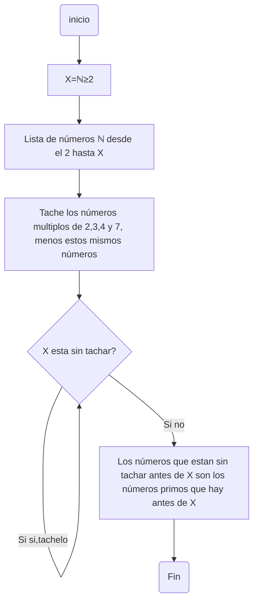

# Reto-3
Algoritmo para hallar los números primos antes que n, escrito en pseudocódigo y en diagrama de flujo
- Algoritmo en Pesudocódigo:

- Algoritmo en digrama de flujo

```mermaid
flowchart TD
    A("inicio") --> B["X=ℕ≥2"]
    B --> C["Lista de números ℕ desde el 2 hasta X"]
    C --> D["Tache los números multiplos de 2,3,4 y 7, menos estos mismos números"]
    D --> E{"X esta sin tachar?"}
    E -- Si si,tachelo --> E
    E -- Si no --> F["Los números que estan sin tachar antes de X son los números primos que hay antes de X"]
    F --> G("Fin")
```

